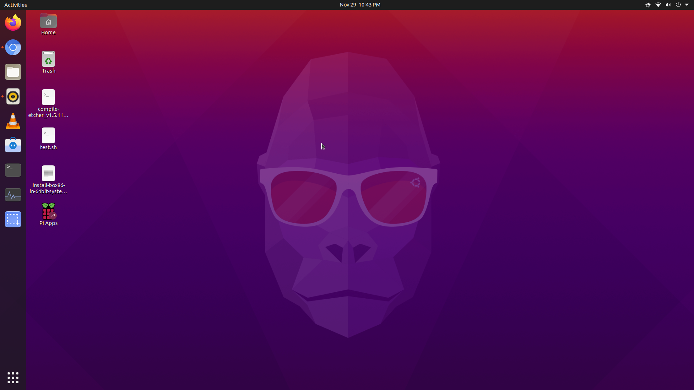
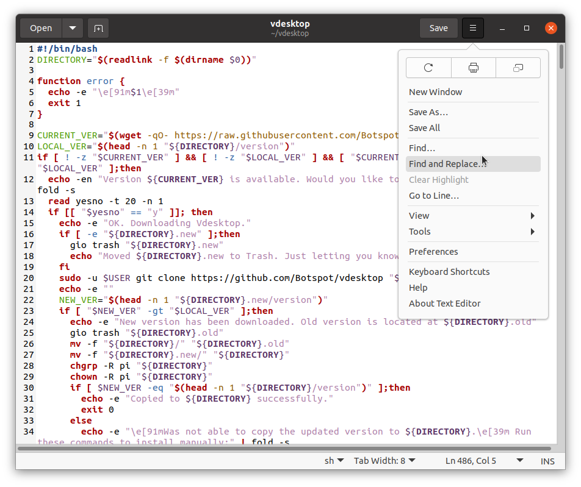
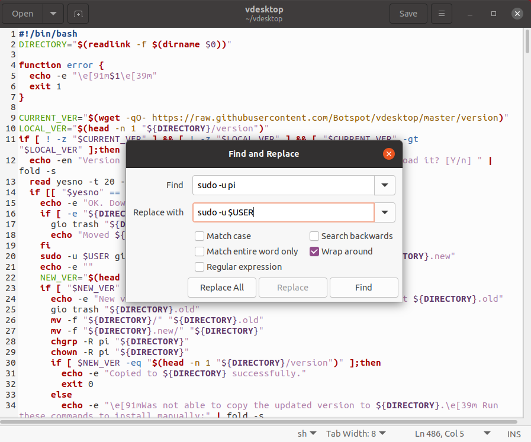

# Ubuntu-on-rpi-fixes
apps, fixes, and optimizations for rpi running Ubuntu desktop


## Install pi-apps

1.go to the [pi-apps github](https://github.com/botspot/pi-apps) and read about it. <br>
2.follow the instructions to install from the readme, I added them bellow:
```sh
git clone https://github.com/botspot/pi-apps.git
~/pi-apps/install
```
## fix choppy audio <br>

1) open terminal and type:
```sh
sudo gedit /etc/pulse/default.pa 
```
the text editor will open, if you get a error similar to `gedit: command not found`, change `gedit` with your text editor or if you are not sure `nano` (nano is a terminal based text editor).

2) find this line: `load-module module-udev-detect` and add to it's end this: `tsched=0` so it looks like this at the end:
```
load-module module-udev-detect tsched=0
```
[(source)](https://www.raspberrypi.org/forums/viewtopic.php?f=131&t=289126&p=1769729#p1769729)

## Fix missing codecs for Videos app (GNOME videos, totem = same app) <br>

### NOTE: this only fixes mp4 video and lets you watch from the built in channels, for anything else I recommend VLC (`sudo apt install vlc`)

<b>full error:</b> `the playback of this movie requires a H.264 (Main Profile) decoder which is not installed`<br>

<b>fix:</b><br>
```sh
sudo apt-get install gstreamer1.0-libav ffmpeg
```

## Install [box86](https://github.com/ptitSeb/box86)

<b>add armhf architecture (multiarch):</b><br>
open terminal and type:
```sh
sudo dpkg --add-architecture armhf
sudo apt update
```
<b>Install dependencies:</b>
<b>for Ubuntu 20.04:</b>
```sh
sudo apt install libc6:armhf  libx11-6:armhf  libgdk-pixbuf2.0-0:armhf libgtk2.0-0:armhf libstdc++6:armhf libsdl2-2.0-0:armhf mesa-va-drivers:armhf libsdl1.2-dev:armhf libsdl-mixer1.2:armhf libpng16-16:armhf libcal3d12v5:armhf libsdl2-net-2.0-0:armhf libopenal1:armhf libsdl2-image-2.0-0:armhf libvorbis-dev:armhf libcurl4:armhf osspd:armhf pulseaudio:armhf libjpeg62:armhf libudev1:armhf libgl1-mesa-dev:armhf libsnappy1v5:armhf libx11-dev:armhf libsmpeg0:armhf libboost-filesystem1.67.0:armhf libboost-program-options1.67.0:armhf libavcodec58:armhf libavformat58:armhf libswscale5:armhf libmyguiengine3debian1v5:armhf libboost-iostreams1.67.0:armhf  libsdl2-mixer-2.0-0:armhf
```

<b>For Ubuntu 20.10</b>
```sh
sudo apt install libc6:armhf  libx11-6:armhf  libgdk-pixbuf2.0-0:armhf libgtk2.0-0:armhf libstdc++6:armhf libsdl2-2.0-0:armhf mesa-va-drivers:armhf libsdl1.2-dev:armhf libsdl-mixer1.2:armhf libpng16-16:armhf libcal3d12v5:armhf libsdl2-net-2.0-0:armhf libopenal1:armhf libsdl2-image-2.0-0:armhf libvorbis-dev:armhf libcurl4:armhf osspd:armhf pulseaudio:armhf libjpeg62:armhf libudev1:armhf libgl1-mesa-dev:armhf libsnappy1v5:armhf libx11-dev:armhf libsmpeg0:armhf libboost-filesystem1.71.0:armhf libboost-program-options1.71.0:armhf libavcodec58:armhf libavformat58:armhf libswscale5:armhf libmyguiengine3debian1v5:armhf libboost-iostreams1.71.0:armhf  libsdl2-mixer-2.0-0:armhf
```
<b>Compile and install box86:</b>

open terminal and type:
```sh
git clone https://github.com/ptitSeb/box86
cd box86
sudo apt update
sudo apt install gcc-arm-linux-gnueabihf
mkdir build; cd build; cmake .. -DRK3399=1 -DCMAKE_BUILD_TYPE=RelWithDebInfo; make -j4
sudo make install
sudo systemctl restart systemd-binfmt
```
### Install box86 updater

1) Go to the [box86 updater github](https://github.com/Botspot/box86-updater)
2) follow the instructions there. I added the bellow as well:

<b>NOTE:</b> This is not finished, and only lightly tested. Proceed at your own risk.
  
<b>Download:</b>
```sh
git clone https://github.com/Botspot/box86-updater
```
<b>Configure:</b>
```sh
~/box86-updater/configure
```
## Install and configure GNOME software

The Ubuntu software app store is actually only the snap store, so to have more apps from flatpak and the Ubuntu archive
use gnome software (if you prefer a graphical "app store"):

<b>Install GNOME software:</b>
```sh
sudo apt install gnome-software
```
<b>add snap and flatpak:</b>
```sh
sudo apt install snapd
sudo apt install flatpak
sudo apt install gnome-software-plugin-flatpak gnome-software-plugin-snap
```

## Install Zoom

1) make sure you have box86 installed and updated, if not [scroll up and follow the instructions to install it.](https://github.com/Itai-Nelken/Ubuntu-on-rpi-fixes/blob/main/README.md#install-box86)

2) Install dependencies:
```sh
sudo apt install libxcb-shape0:armhf libxcb-randr0:armhf libxcb-image:armhf libxcb-image0:armhf libxcb-xtest0:armhf libxcb-keysyms1:armhf libdbus-1-3:armhf libxcb-xtest0:armhf libxcb-xtest0
```
3) Download Zoom:
as of writing, the [zoom website download](https://zoom.us/client/latest/zoom_i686.tar.xz) is down. you can download a offline copy I have from [here](https://github.com/Itai-Nelken/Pi-Assistant/raw/main/apps/zoom/files/zoom.tar.xz)

4) open terminal and type:
```sh
cd ~/Downloads
tar -xf zoom.tar.xz
```
5) create launcher script:<br>
download my [launcher script](https://github.com/Itai-Nelken/Pi-Assistant/blob/main/apps/zoom/startzoom.sh) with this command
```sh
wget https://github.com/Itai-Nelken/Pi-Assistant/blob/main/apps/zoom/startzoom.sh
```
and move it to the zoom folder with this command:
```sh
mv startzoom.sh ~/zoom
```
if you want to create your own script you can use this:
```
#!/bin/bash

function error {
  echo -e "\\e[91m$1\\e[39m"
  exit 1
}


if [ -d ~/box86 ]; then

  echo "box86 installed..."

else
  echo "Box86 missing, please install"
  exit 1 

fi

	
#go to zoom directory (~/zoom)
cd ~/zoom
echo "$(tput setaf 3)close this window to exit zoom$(tput sgr 0)"
sleep 2
echo "$(tput setaf 2)starting zoom, ignore any errors...$(tput sgr 0)"
sleep 1
#start zoom with box86
pulseaudio --start
box86 zoom || error "can't start zoom!"
echo "$(tput setaf 2)exiting in 5 seconds:($(tput sgr 0)"
sleep 5
```

6) create desktop shortcut:<br>
Download my [desktop shortcut file](https://github.com/Itai-Nelken/Pi-Assistant/blob/main/apps/zoom/files/zoom.desktop) with this command:
```sh
wget https://github.com/Itai-Nelken/Pi-Assistant/blob/main/apps/zoom/files/zoom.desktop
```
and move it to /usr/share/applications with this command:
```sh
sudo mv zoom.desktop /usr/share/applications
```
you'll be asked for your password.

if you prefer to create your own shortcut, use this for help:
```
[Desktop Entry]
Version=1.0
Type=Application
Name=Zoom
Comment=Linux x86 version of Zoom cloud meetings running using Box86
Exec=/home/pi/zoom/startzoom.sh
Icon=/home/pi/Pi-Assistant/icons/zoom-icon.png
Path=/home/pi/Pi-Assistant/apps/zoom
Terminal=true
StartupNotify=false
Categories=Network;
```

## Install vdesktop
1) go to the [vdesktop github](https://github.com/botspot/vdesktop) and follow the download instructions, I added them bellow as well:
```sh
git clone https://github.com/Botspot/vdesktop
```
before running there are a few steps to follow if you plan to boot OS's to Desktop as well and not only CLI:

1) <b>Compile VirGL:</b><br>
 -`sudo apt purge libepoxy0:armhf` and `sudo apt purge libepoxy-dev:armhf` <br>
 -`sudo apt install libepoxy0` and `sudo apt install libepoxy-dev`<br>
 -`sudo apt install -y meson libdrm-dev cmake libgbm-dev`<br>
 -`git clone https://gitlab.freedesktop.org/virgl/virglrenderer.git`<br>
 -`cd virglrenderer`<br>
 -`meson --prefix=/usr/local -Dbuildtype=release build`<br>
 -`cd build`<br>
 -`ninja install`<br>
 -`cd ~ && sudo -E ldconfig`<br>
 
 now you need to open `~/vdesktop/vdesktop` with a text editor, on Ubuntu I recommend the included one (gedit) and will use it for the example:
 - after opening the file, click on the 3 lines next to the save button and click on the `find and replace` option in the menu that opens. then use it to replace all `sudo -u pi` with `sudo -u $USER`, use the screenshots bellow for help.



2) <b>run vdesktop:</b>
use the instructions in the [vdesktop github](https://github.com/botspot/vdesktop) to use it, I'm using a usb stick flashed with [TwisterOS](https://twisteros.com), and I want to launch the desktop, so to launch vdesktop, I use `sudo ~/vdesktop/vdesktop /dev/sdb gui`.
follow the prompts to install the dependencies. if you get errors, and vdesktop exits, type in terminal this:
```sh
sudo apt install -f
```
and run vdesktop again.

## To do
- [ ]  [add chromium media edition](https://github.com/monkaBlyat/schroot-chromium-armhf)
- [ ] add chromium optimization(s)
- [ ] make automated script for installations
- [ ] add rpi imager (not snap or flatpak)
- [ ] add bookshelf app from rpiOS
- [ ] add code the classics games (from rpiOS)
